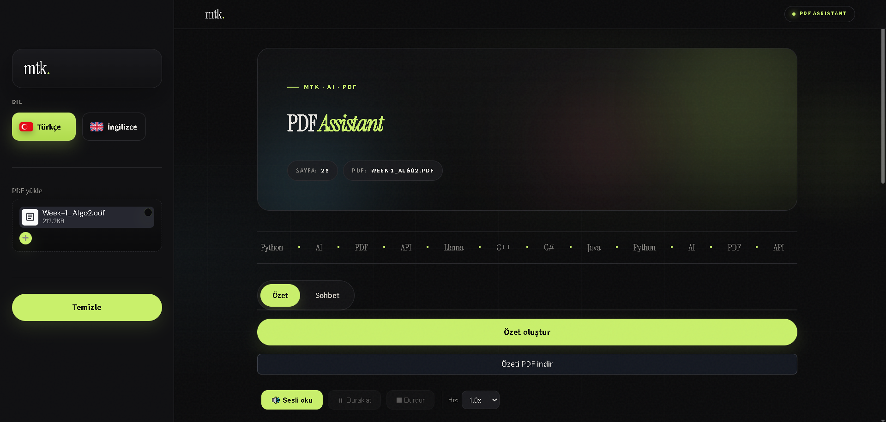

# PDF Assistant — mtk.

PDF Assistant, PDF dosyalarından hızlıca ders notu çıkaran, PDF içeriğiyle sohbet etmeyi sağlayan ve oluşturulan özetleri sesli dinleme / PDF olarak indirme özellikleri sunan açık kaynak bir AI aracıdır.

Streamlit arayüzü ve Groq LLM API ile geliştirilmiştir. Türkçe ve İngilizce dil desteği bulunur.

---

## Özellikler

- PDF yükleyip saniyeler içinde kapsamlı özet oluşturma
- PDF içeriği hakkında soru sorma
- Türkçe / İngilizce arayüz ve çıktı desteği
- Streaming yanıt üretimi
- Büyük PDF’ler için parçalama ve paralel özetleme
- Aynı PDF ve dil için önbellekleme
- Tarayıcı tabanlı sesli okuma desteği
- Özeti stilli PDF olarak dışa aktarma
- Groq LLM modelleriyle hızlı yanıt üretimi
- Hata durumlarında retry, fallback ve kullanıcı dostu hata mesajları

---

## Ekran Görüntüsü

```md

